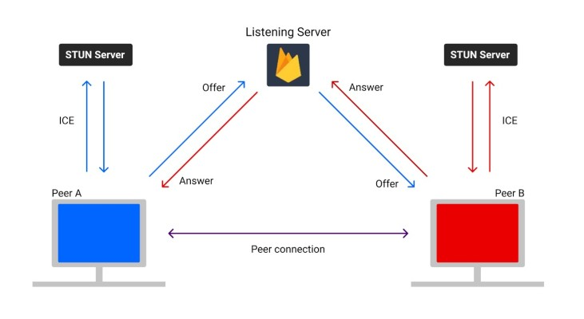
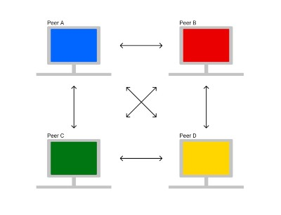
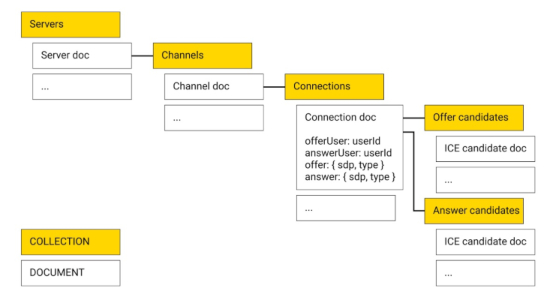

# Discord Clone

A client-side rendered React SPA, utilising a Firebase backend, bundled with Vite.

<!--    -->

**Hosted on Firebase**  
https://definitely-not-discord-8bf44.web.app/

**Sign in options**  
Signing in with a Google account is the only supported sign in method.

## Summary

This project is a feature-light clone of the popular communication platform, Discord. The project began as a UI clone, to demonstrate the ability to follow a design, and quickly morphed into a working text chat application. This further triggered an investigation into WebRTC, and with that came working voice communication channels. A detailed explanation is available in the 'WebRTC Explanation & Implementation Logic' section.

## What I learned

This project allowed me to gain more experience with the real-time update functionality of Firebase Firestore, and the ways in which this document-based NoSQL database layout differs from a relational model. In this instance, the main draw of Firestore was the built-in snapshot listeners, allowing for a 'websockets-like' solution to real-time text chat between users. With Firestore, this proved trivial to implement, along with the authentication API which Firebase makes available.

The more challenging part of this application was the multi-peer voice channels using WebRTC. Prior to this, I had zero experience with this technology, and set about understanding how the connections are made between peers. At which point, I set up a peer to peer channel to confirm my understanding. This was successful, so I drafted a plan to implement a full-mesh topology between multiple peers, where each peer has a connection to every other peer in the channel. Full mesh is the most simple method to connect small numbers of clients, and as I had no intention of scaling this project, the connection formula of n(n-1)/2 was not an issue.

## Features

- Sign in/out functionality
- Server list
- Channel list
- Online user list
- Instant messaging
- Multi-person voice chat (connect/disconnect)
- Voice activity indicator
- Mute/deafen functionality

## Technologies Used

- HTML
- CSS
- TypeScript
- React
- Vite
- Firebase
- WebRTC

## WebRTC Explanation & Implementation Logic

### WebRTC

WebRTC is an open source project which provides an API to native applications, IoT devices, and all major browers, with the intention of facilitating peer to peer data transfer using a common set of protocols. This covers video feeds, file transfers, and for this specific use case, audio. The connection is never truly 'peer to peer', however, because in order for the connection to be established, information regarding the connection needs to be shared to a 'listening server'. Once the connection has been made, the data transfer is peer to peer, and the listening server plays no part, it merely facilitates the connection.

#### To create a connection:

1. Both peers must create an RTCPeerConnection object locally, passing in a STUN server configuration to allow generation of ICE candidates. They must also apply a local media stream to the connection, along with a function that will retrieve the remote media stream once the connection is established.
2. Peer A must post a connection offer to the listening server containing a 'session description protocol' (SDP).
3. Peer B then reads the SDP from the offer, and posts a connection answer, also containing an SDP.
4. Peer A must be listening for this change, and once an answer is available, apply it to the local connection object.
5. Once both peers' local RTCPeerConnections are complete, the peer connection will be established.

The offer and answer must be set to the local and remote descriptions of the RTCPeerConnection object for each user. This object manages the connection SDPs, media streams, and ICE (Interactive Connectivity Establishment) options.

#### ICE Candidates:

In order for the connection to be established, both peers must also share information about the network connection. ICE candidates contain the necessary information for peers to connect even if devices are separated by NAT (Network Address Translation).They are generated by the STUN servers in the configuration passed to the RTCPeerConnection on initialisation, and made available to the client through the peer connection object. Once generated, they must also be exchanged via the listening server.

### Implementation

In order to satisfy the above requirements, !discord uses a Firebase Firestore as a listening server, making use of its ability to listen for real-time updates to collections to exchange SDPs and ICE candidates.

Creating a single peer to peer connection is not especially complicated in an isolated environment. A firestore document is created by the offer user, who then populates it with an offer SDP, and creates a subcollection of ICE candidates. The answer user would then need access to the document Id, enabling them to query the document, read the offer SDP and ICE candidates, then set an answer SDP and a new subcollection with their own ICE candidates. The user creating the offer must be listening for the answer to be set.

This logic is the basis for the implementation behind !discord, however there are additional factors to consider which provide an increase in complexity.

### Connection Order

In a peer to peer environment, the peer to initiate the call sets the offer, and the peer answering responds. The model for !discord is one of channels, where a user connects to a channel, and is then able to communicate with other users in that channel. This presents an issue for the currently described logic, because the connection needs to belong to an offer user and an answer user, and if a user initially connects to a channel which is empty, there is no way of knowing who should answer this connection. To overcome this, the first user to connect does not set up any connections, rather, they listen for connections. When the next user connects they set a connection docment for every user in the channel, with the id of the user that should answer it, and an offer SDP. The connected users then respond to these offers if their id matches the one set on the offer. This provides logic which can be repeated for any number of new users connecting.

### Connection Topology

The topology used to connect the users here is know as a full-mesh, and involves connecting every user to every other user.

Within the channel there should be a connection document for each distinct pair of users, which translates to n \* (n - 1) / 2 connections. Each user who connects adds n - 1 connections (e.g. the 10th user to connect will add 10 - 1 = 9 new connections). This is not scalable. Other, far more scalable options exist, but often require a server to route connections. For example, each user connects to the server, which then sends their submitted data to the other connected users. However, for this project, scalability is not a concern, and over engineering it for minimal gain was not an effective use of time. For a small number of connections, full-mesh is an adequate topology.

### Database Layout

The database serves a dual functionality; as a store for messages sent via the text chat, and as a listening server for the WebRTC implementation. As a Firestore, it is structured in an alternating model of collection -> document -> collection -> document etc.

This begins with a collection of servers, where each server document has a collection of channels. There are two types of channel, a text channel and a voice channel. Text channels have a subcollection of message documents, while the voice channel handles documents related to WebRTC. When the voice channel has no users connected, it should have no subcollections, however, once the second user and onwards connect, there should exist a subcollection of connections. These connection documents, when complete, should have an offer SDP, an answer SDP, the id of the offer user, the id of the answer user, and two subcollections of their own. The subcollections should contain ICE candidates for the offer user, and ICE candidates for the answer user. If either the offer user or the answer user leave the channel, the connection document, and all of its subcollections, should be removed.

### Client-side

The previous sections have described the logic behind making a WebRTC connection, the specific topology chosen for this application, along with the data model required to support it. This section will briefly address the way this is implemented on the client-side in !discord.

The component tree of the project has limited layers, so the WebRTC functionality is implemented as a custom hook, rather than with context, because prop drilling is not an issue. State is handled in a reducer, and tracks an array of connections, and the firestore document ref for the target channel. The state could have been implemented simply with useState, but it initially also tracked users in the channel, until it became apparant that this was not necessary. At this point, the reducer was fully functional, and it would not have been a productive use of time to refactor it for a slight gain in readability.

A set of utility functions complement the custom hook, and their descriptive names make reading and understanding the hook significantly easier. Many of these act as a pipeline, where they accept an RTCPeerConnection object, perform an operation, and return it.

The listening functionality is hanndled by a series of useEffect hooks, which set up firestore listeners, making sure to unsubscribe to them in the return function.

The hook returns a function to connect a user, a function to disconnect, and the state; everything else is handled internally. The connections array in state contains objects which hold all required information about a connection between two users. The id of the users who offered and answered the connection, the firestore references to the offer and answer candidates collections, the connection document reference, the local and remote media stream objects, and the RTCPeerConnection istelf.

The connections array is used to build an array of HTML audio elements, setting their srcObject to the local and remote media streams for that connection.
